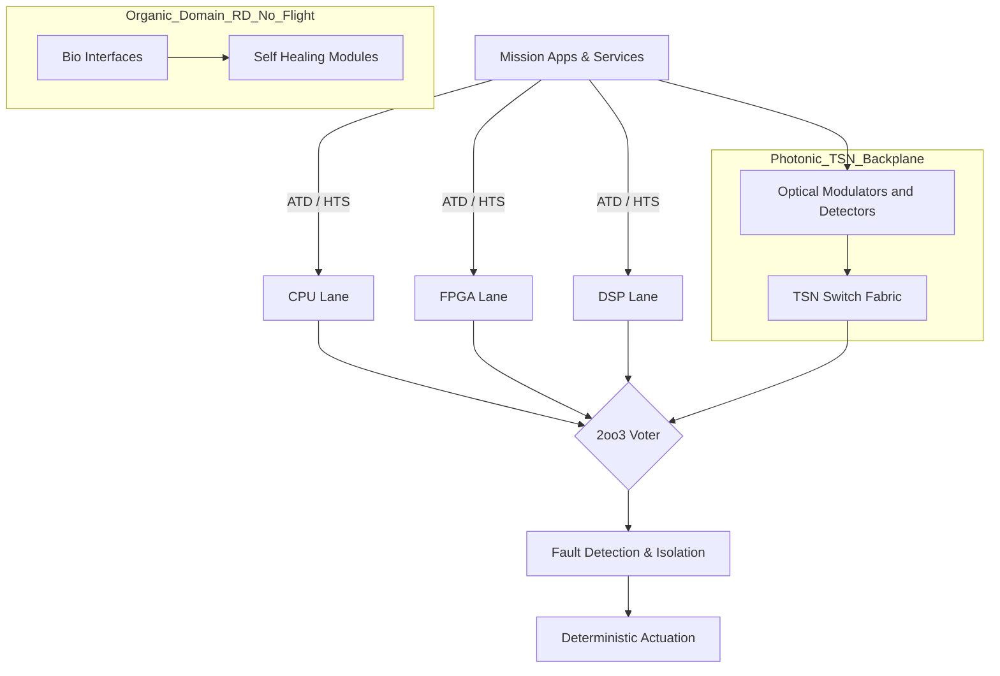
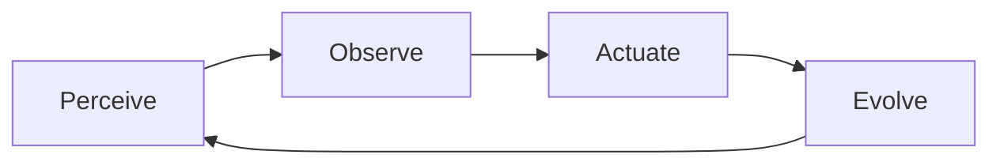
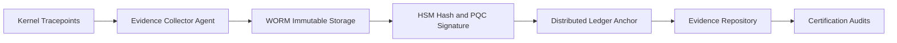

# AMEDEO Systems — AQUA-OS/ADT

**Aerospace Digital Transponder (ADT) para cómputo híbrido certificable**


---

## Aviso y alcance

Este repositorio contiene especificaciones, artefactos LaTeX (Elsevier/IEEE), manifiestos UTCS-MI y pruebas de host para **AMEDEO Systems** con **AQUA-OS/ADT** como núcleo digital.
**No constituye** una declaración de certificación; todos los elementos de cumplimiento (DO-178C/DO-254/DO-326A/ARP4754A, CS-25) se suministran como **evidencia técnica pre-certificable**.

---

## Identificador canónico UTCS-MI v5.0

```
EstándarUniversal:Documento-Desarrollo-DO178C-00.00-AerospaceMainEvolutionDigital-0001-v1.0-AMEDEOSystems-GeneracionHumana-CROSS-AmedeoPelliccia-7f3c9a2b-RestoDeVidaUtil
```

<details>
<summary>Desglose de los 13 campos</summary>

|  # | Campo                    | Valor                              |
| -: | ------------------------ | ---------------------------------- |
|  1 | Clase de artefacto       | Documento                          |
|  2 | Fase de origen           | Desarrollo                         |
|  3 | Regulación de referencia | DO178C                             |
|  4 | Capítulo–Sección         | 00.00                              |
|  5 | Categoría descriptiva    | AerospaceMainEvolutionDigital      |
|  6 | Secuencia                | 0001                               |
|  7 | Versión                  | v1.0                               |
|  8 | Programa del portfolio   | AMEDEOSystems                      |
|  9 | Método de generación     | GeneracionHumana                   |
| 10 | Dominio de aplicación    | CROSS                              |
| 11 | Identificador físico     | AmedeoPelliccia                    |
| 12 | Hash de contenido        | 7f3c9a2b *(recalcular en release)* |
| 13 | Periodo de validez       | RestoDeVidaUtil                    |

</details>

---

## Estructura del repositorio

```
.
├─ amedeo_elsevier.tex          # Elsevier (elsarticle.cls)
├─ main_ieee.tex                # IEEE (IEEEtran)
├─ refs.bib                     # Bibliografía (DO-178C/DO-254/DO-326A/ARP4754A/TSN/PQC…)
├─ manifest.json                # Descriptor UTCS-MI
├─ manifest_check.py            # Validador UTCS-MI
├─ figs/
│  ├─ triadic_arch.pdf
│  ├─ loop_POAE.pdf
│  └─ det_pipeline.pdf
├─ tables/
│  └─ comparison.tex            # Tabla AMEDEO vs IMA
├─ docs/specifications/
│  ├─ aqua-nisq-chip.yaml
│  ├─ qec-lite.yaml
│  ├─ control-plane.yaml
│  └─ qal-backend-aqua.yaml
├─ tests/
│  └─ ata27_flight_ctrl_host.c
└─ .github/workflows/
   └─ ci.yml                    # CI: manifest + LaTeX
```

---

## Requisitos

* **TeX Live** (latexmk, elsarticle, IEEEtran, TikZ/PGF).
* **Python ≥ 3.10** (para `manifest_check.py`).
* *(Opcional)* **Mermaid CLI** para exportar diagramas a PDF:
  `npm i -g @mermaid-js/mermaid-cli`.

---

## Compilación

**Elsevier (preprint)**

```bash
latexmk -pdf -shell-escape -interaction=nonstopmode -file-line-error amedeo_elsevier.tex
```

**IEEE**

```bash
latexmk -pdf -shell-escape -interaction=nonstopmode -file-line-error main_ieee.tex
```

**Exportar Mermaid → PDF** *(si desea incrustar en LaTeX)*

```bash
mmdc -i docs/diagrams/triadic_arch.mmd -o figs/triadic_arch.pdf
mmdc -i docs/diagrams/loop_POAE.mmd     -o figs/loop_POAE.pdf
mmdc -i docs/diagrams/det_pipeline.mmd  -o figs/det_pipeline.pdf
```

---

## Validación UTCS-MI

**`manifest.json`**

```json
{
  "utcs_mi": "EstándarUniversal:Documento-Desarrollo-DO178C-00.00-AerospaceMainEvolutionDigital-0001-v1.0-AMEDEOSystems-GeneracionHumana-CROSS-AmedeoPelliccia-7f3c9a2b-RestoDeVidaUtil",
  "artifact": {
    "class": "Documento",
    "phase": "Desarrollo",
    "reg": "DO178C",
    "chapter": "00.00",
    "category": "AerospaceMainEvolutionDigital",
    "seq": "0001",
    "version": "v1.0",
    "program": "AMEDEOSystems",
    "method": "GeneracionHumana",
    "domain": "CROSS",
    "author": "AmedeoPelliccia",
    "content_hash": "7f3c9a2b",
    "validity": "RestoDeVidaUtil"
  }
}
```

**Ejecutar validador**

```bash
python3 manifest_check.py
```

> Recalcule `artifact.content_hash` en cada release (p. ej. `sha256sum build/AMEDEO.pdf | cut -c1-8` o `git rev-parse --short=8 HEAD`).

---

## CI/CD (GitHub Actions)

`.github/workflows/ci.yml`

```yaml
name: CI
on: [push, pull_request]

jobs:
  manifest:
    runs-on: ubuntu-latest
    steps:
      - uses: actions/checkout@v4
      - uses: actions/setup-python@v5
        with: { python-version: '3.11' }
      - name: Validate UTCS-MI manifest
        run: python3 manifest_check.py

  latex-elsevier:
    runs-on: ubuntu-latest
    needs: manifest
    steps:
      - uses: actions/checkout@v4
      - uses: xu-cheng/latex-action@v3
        with: { root_file: amedeo_elsevier.tex }
      - uses: actions/upload-artifact@v4
        with: { name: elsevier-pdf, path: amedeo_elsevier.pdf }

  latex-ieee:
    runs-on: ubuntu-latest
    needs: manifest
    steps:
      - uses: actions/checkout@v4
      - uses: xu-cheng/latex-action@v3
        with: { root_file: main_ieee.tex }
      - uses: actions/upload-artifact@v4
        with: { name: ieee-pdf, path: main_ieee.pdf }
```

---

## Diagramas (Mermaid — compatibles con GitHub)

### TCA — Triadic Computational Architecture



### POAE — Perceive → Observe → Actuate → Evolve



### DET — Digital Evidence Twin Pipeline



### CQEA — Extensión híbrida cuántico-clásica del backplane fotónico


---

## Tabla comparativa — AMEDEO vs IMA

| Dimensión      | IMA (ARINC 653 / RTOS)       | AMEDEO Systems (AQUA-OS/ADT)                     |
| -------------- | ---------------------------- | ------------------------------------------------ |
| Arquitectura   | Electrónica homogénea        | Triádica: CPU+FPGA+DSP, fotónica, orgánica (I+D) |
| Determinismo   | Particiones temporales fijas | 2oo3 + Hybrid Task Scheduler                     |
| Adaptabilidad  | Actualizaciones limitadas    | POAE + WEE (gobernado)                           |
| Redes          | AFDX                         | TSN fotónico, jitter ≤ 1 µs                      |
| Seguridad      | Cripto clásica               | Zero-Trust + PQC (Kyber/Dilithium) + FAT/HSM     |
| Evidencia      | Documentación manual         | DET, safety-cases-as-code, firmas PQC            |
| Sostenibilidad | KPIs indirectos              | EaP: presupuestos energía/CO₂ en runtime         |
| Legado         | Portado costoso              | Intérprete FORTRAN + Ada/SPARK/C                 |

---

## Especificaciones (extracto “paste-ready”)

**`docs/specifications/aqua-nisq-chip.yaml`**

```yaml
version: 1.0
target: { v1_lab: true, v2_flight_path: true }
technology: { modality: superconducting_transmon, substrate: sapphire, junction: Al/AlOx/Al }
topology: { qubits: 64, coupling: nearest_neighbor, resonators_readout: multiplexed_8to1, couplers: tunable_coupler_flux }
frequencies: { qubit_ghz: [4.8, 6.2], readout_ghz: [6.5, 7.5], anharm_mhz: 200-300 }
performance_targets:
  t1_us_typ: 100
  t2_us_typ: 80
  gate_1q_ns: 20-40
  gate_2q_ns: 120-200
  fid_1q: 0.999
  fid_2q: 0.992
  readout_ns: 300
  readout_fid: 0.99
error_mitigation: [zero_noise_extrapolation, randomized_compiling, dynamical_decoupling]
qec_readiness: { code: surface_d3_patch_demo, ancilla_ratio: 0.5, cycle_ns: 1000 }
calibration: { routines: [rabi, t1, t2, ramsey, rb_1q, rb_2q, readout_opt], cadence_min: 15 }
interfaces: { ref_clock_in: 10MHz, pps_in: 1Hz, sync_align: TSP@AEIC, triggers: { start, stop, marker[0..3] } }
control_electronics:
  awg: { channels: 128, rate_gsps: 2, bits: 14 }
  adc: { channels: 16, rate_gsps: 2, bits: 12 }
  lo_distribution: coherent
  feedforward_latency_ns: 200
cryogenics: { base_temp_mK: 10, line_count: { drive: 64, readout: 8, flux: 64 }, bpf_loss_db: <=1.5, mxr_chain: { hemt_4k: true, isolators: 2 } }
packaging: { type: 3d_integration_interposer, connectors: high_density_microwave, crosstalk_q_to_q_db: <= -40 }
safety_governance: { seal_gates: [energy, temp, clock_integrity, sensor], power_limit_w: 2.0 }
flight_path_notes: { microcryostat: "1-4K study", rad_tolerance: proton_total_dose_testing }
```

**`docs/specifications/qec-lite.yaml`**

```yaml
scheme: surface_like_demo
features: [post_selection, leakage_reset, pauli_twirl]
mitigation: [zne, rc, dd_xy8]
criteria: { two_qubit_error_rate_max: 0.008, logical_demo: bell_state_distance3 }
```

**`docs/specifications/control-plane.yaml`**

```yaml
transport: pcie_gen4 || ethernet_tsn
protocol: { command_stream: capnp_binary, data_stream: frames_iq_16b }
time: { ref_10mhz: required, pps_align: required, tsp_telemetry: { phase_ns, freq_ppb, holdover_s } }
health: { metrics: [mix_temp_mK, hemt_bias, line_atten_db, readout_snr_db] }
```

**`docs/specifications/qal-backend-aqua.yaml`**

```yaml
backend_id: AQUA_NISQ_V1
jobs:
  - { id: QOPT, max_qubits: 32, depth_max: 128, budget_ms: 50 }
  - { id: QSIM, max_qubits: 20, depth_max: 256, budget_ms: 100 }
latency: { submit_to_start_us_p99: 500, readout_to_result_us_p99: 800 }
sync: { ref: TSP, pps_align: true }
security: { attest: required, hw_roots: true }
```

---

## Prueba de host (ATA-27 Flight Control)

Ejecuta **1.000 pasos @ 1 kHz** con trazas DET/SEAL simuladas y aserciones 2oo3:

```bash
mkdir -p build
gcc -O2 -Iinclude \
  tests/ata27_flight_ctrl_host.c \
  src/Voter_Logic.c src/HAL_Sim.c \
  -o build/ata27_host

./build/ata27_host
```

> Salida: consenso pass/fail, heartbeat, entradas DET simuladas.

---

## Bibliografía (extracto BibTeX)

```bibtex
@misc{DO178C,  title={DO-178C: Software Considerations in Airborne Systems}, howpublished={RTCA/EUROCAE}, year={2011}}
@misc{DO254,   title={DO-254: Design Assurance Guidance for Airborne Electronic Hardware}, howpublished={RTCA/EUROCAE}, year={2000}}
@misc{DO326A,  title={DO-326A: Airworthiness Security Process Specification}, howpublished={RTCA}, year={2014}}
@misc{ARP4754A,title={ARP4754A: Guidelines for Development of Civil Aircraft and Systems}, howpublished={SAE}, year={2010}}
@misc{IEEE8021TSN, title={IEEE 802.1 Time-Sensitive Networking Standards}, howpublished={IEEE}, year={2022}}
@misc{KyberNIST,   title={CRYSTALS-Kyber: KEM}, howpublished={NIST PQC}, year={2024}}
@misc{DilithiumNIST,title={CRYSTALS-Dilithium: Digital Signatures}, howpublished={NIST PQC}, year={2024}}
```

---

## Contribución y gobernanza

* Todo PR debe pasar **validación UTCS-MI** y **build LaTeX** en CI.
* Convención de versiones: **SEMVER** para specs y plantillas.
* Commits firmados (GPG) recomendados.
* Para vulnerabilidades, escriba a **[security@aqua.aerospace](mailto:security@aqua.aerospace)** (no abra issues públicos).

---

## Licencia y contacto

**Licencia:** Apache-2.0
**Contacto:** [info@aqua.aerospace](mailto:info@aqua.aerospace) · Madrid, España

> **AMEDEO Systems** — marco unificado para la evolución digital, ambiental y operativa en entornos aeroespaciales; **AQUA-OS/ADT** como transpondedor digital certificable.

