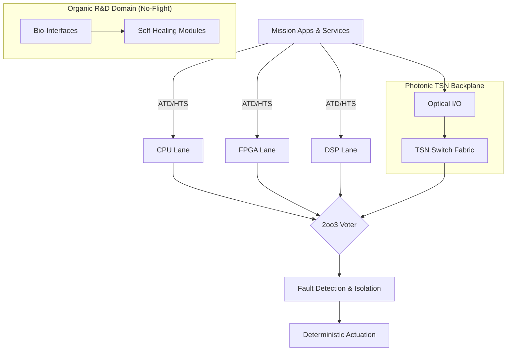
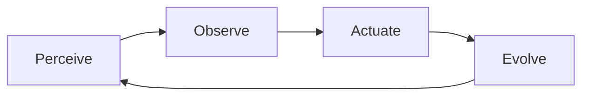
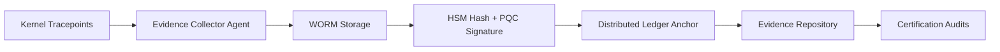
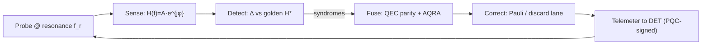

# AMEDEO Systems (P0) — README

**AMEDEO Systems** is a unified, certifiable framework for the **digital, environmental, and operational evolution** of aerospace systems.
**AQUA-OS/ADT** acts as the **certifiable digital transponder**, bridging legacy avionics with multi-physics computing.

---

## Scope (P0)

* Infrastructure: CMake, CI (GitHub Actions/Jenkins), code style/configs.
* **UTCS-MI v5.0** enforcement (manifest + checker + pre-commit).
* Specs (YAML + JSON Schema) with CI validation.
* Core C components:

  * **2oo3 voter**, **HAL\_Sim**, **DET** (stub), **PQC** (Kyber/Dilithium mock), **TSN** simulator (deterministic), **POAE** loop.
* **ATA-27** host test: **1 kHz**, **1000 steps**, DET traces, 2oo3 assertions.
* Mermaid diagrams + minimal LaTeX (Elsevier + IEEE) built in CI.

---

## Build

```bash
cmake -S . -B out
cmake --build out --config Release
./out/tests_ata27_flight_ctrl_host
```

---

## Pre-commit hook

```bash
git config core.hooksPath .githooks
```

* Hook runs: `python3 tools/manifest_check.py`

---

## UTCS-MI v5.0

* **Canonical identifier** (for this document):

```
EstándarUniversal:Documento-Desarrollo-DO178C-00.00-AerospaceMainEvolutionDigital-0001-v1.0-AMEDEOSystems-GeneracionHumana-CROSS-AmedeoPelliccia-7f3c9a2b-RestoDeVidaUtil
```

* **Manifest**: `UTCS/manifest.json` (map: `path → canonical id`)
* **Checker**: `tools/manifest_check.py` validates structure + file existence.

---

## CI

* **GitHub Actions**: `.github/workflows/ci.yml`

  * Build + tests + UTCS-MI + schema validation + Mermaid render + LaTeX (Elsevier/IEEE) → artifacts.
* **Jenkins**: `Jenkinsfile` mirrors core stages for on-prem runs.

---

## Quality Gates (P0)

* **UTCS-MI**: 100% artifacts listed and passing checker.
* **Build**: `-Wall -Wextra -Werror -O2 -pedantic` clean.
* **Test**: 1000 steps @1 kHz, **no voter mismatches**; sim jitter ≤ **1 ms**.
* **Schemas**: All YAML pass JSON Schema.
* **SAST**: `cppcheck` — no high findings.

---

## Directory (top-level)

```text
AMEDEO-Systems/
├─ README.md
├─ CMakeLists.txt          ── Build system
├─ .github/workflows/ci.yml── CI pipeline
├─ UTCS/manifest.json      ── UTCS-MI registry
├─ docs/
│  ├─ diagrams/            ── Mermaid sources (TCA, POAE, DET)
│  └─ latex/               ── Elsevier/IEEE templates + refs.bib
├─ include/amedeo/         ── Public headers (voter, HAL, DET, PQC, TSN, POAE)
├─ src/amedeo/             ── Core C modules (voter_logic, hal_sim, etc.)
├─ domains/AIR_CIVIL_AVIATION/ATA-27-00/bwb-flight-control.cpp
├─ drivers/qpu/            ── QPU shim (aqua_nisq)
├─ kernel/quantum/         ── QAL backend (aqua)
└─ tests/ata27_flight_ctrl_host.c
```

---

## Diagrams (Mermaid)

> **Note:** Titles use quotes to ensure GitHub Mermaid renders correctly.

**TCA — Triadic Computational Architecture**



**POAE — Perceive → Observe → Actuate → Evolve**



**DET — Digital Evidence Twin Pipeline**



---

## Comparative Table — AMEDEO vs. IMA

| Dimension      | IMA (ARINC 653/RTOS)   | **AMEDEO Systems (AQUA-OS/ADT)**                 |
| -------------- | ---------------------- | ------------------------------------------------ |
| Architecture   | Homogeneous electronic | **Triadic**: CPU+FPGA+DSP, photonic, organic     |
| Determinism    | Static time partitions | **2oo3 + Hybrid Task Scheduler (HTS)**           |
| Adaptability   | Limited updates        | **POAE loop + WEE (gated)**                      |
| Networking     | AFDX                   | **TSN photonic**, jitter ≤ **1 µs**              |
| Security       | Classical crypto       | **Zero-Trust + PQC (Kyber/Dilithium) + HSM/FAT** |
| Evidence       | Docs/logs manual       | **DET**: safety-cases-as-code, PQC-anchored      |
| Sustainability | Indirect KPIs          | **EaP**: energy/CO₂ budgets at runtime           |
| Legacy         | Costly porting         | **FORTRAN interpreter + Ada/SPARK/C**            |

---

## Tests — ATA-27 Host (1 kHz)

* **Path**: `tests/ata27_flight_ctrl_host.c`
* **Run**: 1000 steps @1 kHz with deterministic `HAL_Sim`, **DET** trace stubs, **2oo3** consensus assertions.

---

## LaTeX (Docs)

* Elsevier: `docs/latex/amedeo_elsevier.tex`
* IEEE: `docs/latex/main_ieee.tex`
* BibTeX: `docs/latex/refs.bib`
* Built by CI and published as artifacts.

---

## License & Contact

* License: see `LICENSE`
* Contact: `info@aqua.aerospace`

---

## Acronyms & Glossary (Project-Scoped)

* **ADT** — *Aerospace Digital Transponder* (AQUA-OS core role).
* **AEIC** — *Application Entangling Interfaced Context* (sync coupling).
* **AFDX** — *Avionics Full-Duplex Switched Ethernet*.
* **AGGI** — *Artificial General Global Intelligence* (system-of-systems orchestration).
* **AMEDEO** — *Aerospace Main Evolution of Digital, Environmental and Operating Systems* (umbrella program).
* **AMOReS** — *Aerospace Master Operative Regulating System* (governance/compliance).
* **ARINC 653** — Avionics partitioning standard (temporal/spatial isolation).
* **ATD** — *Autonomous Task Dispatcher* (workload decomposition/dispatch).
* **AQUA-OS** — *Aerospace and Quantum United Applications — Operating System* (this repo’s OS).
* **AQMC** — *Aerospace & Quantum Main Cluster* (legacy label; subsumed by AMEDEO).
* **BWB** — *Blended-Wing Body* (aircraft configuration; e.g., BWB-Q100).
* **CQEA** — *Classical Quantum-Extensible Applications* (hybrid app layer).
* **CS-25** — EASA Certification Specifications for Large Aeroplanes.
* **CMake/CI/CD** — Build system / Continuous Integration/Delivery.
* **DET** — *Digital Evidence Twin* (immutable, PQC-signed runtime evidence).
* **DeMOS** — *Dual-Engined Metrics Operational System* (KPIs/utility).
* **DO-178C** — Software considerations for airborne systems (DAL-A/B/C…).
* **DO-254** — Design assurance for airborne electronic hardware.
* **DO-326A** — Airworthiness security process specification (cyber).
* **EaP** — *Energy-as-Policy* (runtime energy/CO₂ budgets).
* **FDI / FDIR** — *Fault Detection (Isolation/Recovery)*.
* **FAT** — *Flight Authorization Token* (authZ token for flight ops).
* **GAIA AIR-RTOS** — Intelligent real-time OS (deterministic kernel).
* **HAL / HAL\_Sim** — *Hardware Abstraction Layer* / deterministic host sim.
* **HSM** — *Hardware Security Module*.
* **HTS** — *Hybrid Task Scheduler* (tri-substrate scheduling).
* **IMA** — *Integrated Modular Avionics*.
* **ISO/IEC/ETSI/IEEE** — Standards bodies (e.g., ISO 9001, ETSI QKD, IEEE TSN).
* **Kyber / Dilithium** — NIST PQC KEM / signature algorithms.
* **Mermaid** — Markdown diagrams (GitHub-native rendering).
* **NISQ** — *Noisy Intermediate-Scale Quantum* (era/hardware class).
* **P0…P9** — Priority batches (incremental roadmap).
* **PPOA / MMRO / MROR** — *Predictive & Preventive Overall Overhaul* / *Monitoring, Maintenance, Repair & Overhaul* / *Material Recycling Over Retirement* (lifecycle).
* **PQC** — *Post-Quantum Cryptography*.
* **POAE** — *Perceive–Observe–Actuate–Evolve* loop.
* **QAL** — *Quantum Abstraction Layer*.
* **QASI-AERIAL** — *Quantum-API Structured Implementation for Aerial Autonomy*.
* **QEC / ZNE / RC / DD** — *Quantum Error Correction* / *Zero-Noise Extrapolation* / *Randomized Compiling* / *Dynamical Decoupling*.
* **QKD** — *Quantum Key Distribution*.
* **SICOCA** — *Sustainable Industrial Chain Optimisation Circuit* (supply chain as QUBO/Ising circuit).
* **SEAL** — *Serving Entanglement API Locking* (atomic verify+actuate).
* **SPARK/Ada** — Language/toolset for formal verification.
* **TSN** — *Time-Sensitive Networking* (deterministic networking).
* **TSP** — *Temporal Sync Protocol* (time/phase telemetry; `TSP@AEIC`).
* **UTCS-MI** — *Universal Technical Content Standard — Machine-Interpretable* (13-field identifier).
* **WEE** — *Wisdom Evolution Engine* (learning/evolution engine).
* **2oo3** — *Two-out-of-Three* voting (heterogeneous redundancy).
* **AQRA** — *AMEDEO Quantum Resonance Algorithm*: resonance-based error detection & correction across photonic/QAL layers, fused with QEC and 2oo3 voting.

---
# Appendix A

---

## ▲ README — New Section

### AMEDEO Quantum Resonance Algorithm (AQRA)

**Purpose.** Resonance-driven EDC that detects faults via **phase/frequency response anomalies** and applies **syndrome-guided recovery**. AQRA complements QEC-lite (surface-like) and operates across the **Photonic TSN hybrid backplane** and **QAL**.

**Principle.**

1. **Probe:** inject calibrated micro-pulses at reference resonances $f_r$ (per qubit/lane).
2. **Sense:** measure complex response $H(f)=A(f)e^{j\phi(f)}$.
3. **Detect:** compute residuals vs. golden $H^\*$ → $\Delta A,\ \Delta\phi$, lock error if $\|\Delta\|>\tau$.
4. **Syndrome:** map locked errors to stabilizers; fuse with QEC parity checks.
5. **Correct:** apply Pauli $\{X,Z,Y\}$ or discard lane; escalate to 2oo3 voter if needed.

**Latency budget.** Probe+fit ≤ **100 µs**, classify ≤ **30 µs**, correct ≤ **20 µs** (≤ **150 µs** total, fits TSN ≤200 µs).

**Targets (P0/P1).**

* Detection $P_D$ ≥ **0.995**, False Alarm $P_{FA}$ ≤ **1e-3** (lab).
* Phase-lock RMS ≤ **500 ps** (TSP).
* Net QAOA-8 gain with ZNE ≥ **1.5×** (with AQRA active).

---

## ▲ Mermaid (safe labels)



---

## ▲ Spec (add to `docs/specifications/aqra.yaml`)

```yaml
spec_id: AQRA-V1
version: 1.0
owner: AMEDEO Systems
purpose: "Resonance-based error detection & correction for CQEA/QEC-lite."
interfaces:
  sync: TSP@AEIC
  control_plane: CTRL-PLANE-V2
  evidence: DET@PQC
resonance_probe:
  fr_grid_ghz: [4.8, 6.2]
  dwell_us: 10
  amp_dbm: -40
  sweep_points: 17
detection:
  fit_model: lorentzian_complex
  thresholds:
    amp_db: 0.5
    phase_deg: 3.0
    chisq_max: 2.0
fusion:
  qec: surface_like_demo
  policy: "apply_pauli_else_discard_lane"
latency_budget_us:
  probe_fit: 100
  classify: 30
  correct: 20
telemetry:
  det_fields: [fr, amp, phase, chisq, syndrome, action, ts]
  sign: pqc_dilithium3
```

---

## ▲ C API (add `include/amedeo/aqra.h`)

```c
#pragma once
#include <stdint.h>
#ifdef __cplusplus
extern "C" {
#endif

typedef struct {
  float fr_min_ghz, fr_max_ghz;
  uint16_t sweep_points;
  float dwell_us, amp_dbm;
  float thr_amp_db, thr_phase_deg, chisq_max;
} aqra_conf_t;

typedef struct { float amp_db; float phase_deg; float chisq; } aqra_feat_t;
typedef enum { AQRA_OK=0, AQRA_ALERT=1, AQRA_FAULT=2 } aqra_flag_t;
typedef enum { AQRA_ACT_NONE=0, AQRA_ACT_PX, AQRA_ACT_PZ, AQRA_ACT_PY, AQRA_ACT_DROP } aqra_action_t;

typedef struct {
  aqra_feat_t feat;
  aqra_flag_t flag;
  aqra_action_t action;
  uint32_t syndrome_mask;
} aqra_result_t;

int aqra_init(const aqra_conf_t* cfg);
int aqra_probe_and_fit(uint16_t lane_id, aqra_feat_t* out);     // probe H(f), fit features
int aqra_detect(const aqra_feat_t* f, aqra_flag_t* flag);       // compare vs golden
int aqra_fuse_syndrome(uint32_t qec_mask, aqra_flag_t* flag, uint32_t* out_mask);
int aqra_correct(uint16_t lane_id, uint32_t synd, aqra_action_t* action); // apply Pauli/drop
int aqra_step(uint16_t lane_id, uint32_t qec_mask, aqra_result_t* out);   // end-to-end
#ifdef __cplusplus
}
#endif
```

---

## ▲ C stub (add `src/amedeo/aqra.c`)

```c
#include "amedeo/aqra.h"
#include <math.h>
static aqra_conf_t G;

int aqra_init(const aqra_conf_t* cfg){ G=*cfg; return 0; }

static float s_abs(float x){ return x < 0 ? -x : x; }

int aqra_probe_and_fit(uint16_t lane_id, aqra_feat_t* out){
  (void)lane_id;
  // TODO: acquire IQ frames from CTRL-PLANE-V2, fit Lorentzian
  out->amp_db = 0.0f; out->phase_deg = 0.0f; out->chisq = 1.0f;
  return 0;
}

int aqra_detect(const aqra_feat_t* f, aqra_flag_t* flag){
  *flag = (s_abs(f->amp_db) > G.thr_amp_db || s_abs(f->phase_deg) > G.thr_phase_deg || f->chisq > G.chisq_max)
          ? AQRA_ALERT : AQRA_OK;
  return 0;
}

int aqra_fuse_syndrome(uint32_t qec_mask, aqra_flag_t* flag, uint32_t* out_mask){
  *out_mask = qec_mask;                 // placeholder fusion
  if (*flag==AQRA_ALERT && qec_mask)    // alert + parity → escalate
    *flag = AQRA_FAULT;
  return 0;
}

int aqra_correct(uint16_t lane_id, uint32_t synd, aqra_action_t* action){
  (void)lane_id;
  if (synd & 0x1u) *action = AQRA_ACT_PX;
  else if (synd & 0x2u) *action = AQRA_ACT_PZ;
  else if (synd & 0x4u) *action = AQRA_ACT_PY;
  else *action = AQRA_ACT_DROP;
  return 0;
}

int aqra_step(uint16_t lane_id, uint32_t qec_mask, aqra_result_t* out){
  aqra_feat_t f; aqra_flag_t fl; uint32_t sm; aqra_action_t act;
  aqra_probe_and_fit(lane_id,&f);
  aqra_detect(&f,&fl);
  aqra_fuse_syndrome(qec_mask,&fl,&sm);
  aqra_correct(lane_id,sm,&act);
  out->feat=f; out->flag=fl; out->action=act; out->syndrome_mask=sm;
  return 0;
}
```

---

## ▲ Test hook (add `tests/aqra_host.c`)

```c
#include "amedeo/aqra.h"
#include <assert.h>
int main(void){
  aqra_conf_t cfg = {.fr_min_ghz=4.8f,.fr_max_ghz=6.2f,.sweep_points=17,.dwell_us=10,
                     .amp_dbm=-40,.thr_amp_db=0.5f,.thr_phase_deg=3.0f,.chisq_max=2.0f};
  aqra_init(&cfg);
  aqra_result_t r;
  for(int i=0;i<1000;i++){
    aqra_step(0 /*lane*/, 0x3 /*mock syndrome*/, &r);
    assert(r.action==AQRA_ACT_PX || r.action==AQRA_ACT_PZ || r.action==AQRA_ACT_PY || r.action==AQRA_ACT_DROP);
  }
  return 0;
}
```

---

## ▲ Build integration

* **CMakeLists.txt** — add sources:

```cmake
target_sources(amedeo PRIVATE src/amedeo/aqra.c)
target_include_directories(amedeo PUBLIC include)
add_executable(tests_aqra_host tests/aqra_host.c)
target_link_libraries(tests_aqra_host amedeo)
```

* **CI** — run `tests_aqra_host` alongside ATA-27 host test.

---

## ▲ DET fields (append to collector)

```
aqra.fr, aqra.amp_db, aqra.phase_deg, aqra.chisq, aqra.flag, aqra.syndrome, aqra.action, ts
```

---

## ▲ UTCS-MI ID (register in `UTCS/manifest.json`)

```
"docs/specifications/aqra.yaml":
"EstándarUniversal:[Especificacion][Desarrollo][AQUA][AQRA][ResonanceEDC][0007][v1.0][AMEDEO][GeneracionHumana][CROSS][AQRA][<hash>][Vigente]"
```

*(compute `<hash>` with your existing checker on commit)*

---


