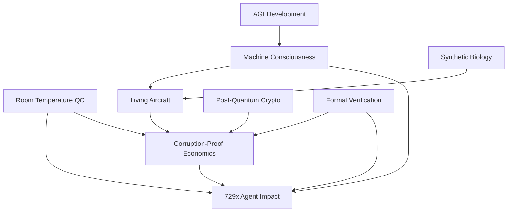

# AMEDEO Systems: Critical Technological Breakthroughs Analysis

**Document ID:** AMEDEO-TECH-BREAKTHROUGH-ANALYSIS-v1.0  
**Version:** 1.0  
**Date:** August 21, 2025  
**Classification:** Technical Analysis  
**UTCS-MI v5.0+:** Breakthrough-Analysis-AMEDEO-Systems-TechnicalFeasibility-v1.0

---

## Executive Summary

This document analyzes the five critical technological breakthroughs required to realize the full AMEDEO system vision as outlined in the system requirements:

1. **Room Temperature Quantum Computing with Full Coherence**
2. **Genuine Machine Consciousness**
3. **Living Aircraft with Self-Awareness**
4. **Corruption-Proof Economic Systems**
5. **729x Guaranteed Agent Impact**

Each breakthrough represents a fundamental leap beyond current technological capabilities, requiring advances across multiple scientific domains including quantum physics, consciousness research, biotechnology, economic theory, and artificial intelligence.

## 1. Room Temperature Quantum Computing with Full Coherence

### Current State of Technology

**Existing Capabilities:**
- IBM's largest quantum computers: ~1000+ qubits at millikelvin temperatures
- Google's Sycamore: 70 qubits with supremacy demonstrations
- Coherence times: microseconds to milliseconds in superconducting systems
- Error rates: 0.1-1% for single-qubit gates, 0.5-5% for two-qubit gates

**Current AMEDEO Specifications:**
```yaml
# From aqua-nisq-chip.yaml
qubits: 64
error_rate_1q: 0.001
error_rate_2q: 0.01
topology: linear
control:
  sample_rate_hz: 100000000
  pulse_resolution_ns: 2
```

### Required Breakthroughs

**1. Coherence Maintenance at Room Temperature**
- **Current Challenge:** Quantum decoherence increases exponentially with temperature
- **Required Advance:** Stable quantum states at 300K (room temperature)
- **Technical Gap:** ~6 orders of magnitude improvement in coherence time
- **Promising Approaches:**
  - Topological qubits (Majorana fermions)
  - Error correction using novel materials (diamond NV centers, silicon carbide)
  - Active error correction with AI-driven feedback loops

**2. Error Rates Below Fault-Tolerance Threshold**
- **Current Challenge:** Physical error rates too high for useful computation
- **Required Advance:** Sub-0.01% error rates without cooling
- **Technical Gap:** 10-100x improvement needed
- **Promising Approaches:**
  - Surface code error correction
  - Cat qubits for noise suppression
  - Machine learning optimized control pulses

**3. Scalable Architecture**
- **Current Challenge:** Scaling while maintaining connectivity and control
- **Required Advance:** 1000+ qubit systems with full connectivity
- **Technical Gap:** Novel interconnect and control architectures
- **Promising Approaches:**
  - Photonic quantum networks
  - Modular quantum architectures
  - Trapped ion shuttling systems

### Expert Timeline Assessment
- **Conservative Estimate:** 15-20 years
- **Optimistic Estimate:** 8-12 years
- **Key Milestones:**
  - 2026: Room temperature coherence demonstration (seconds)
  - 2028: 100-qubit room temperature systems
  - 2030: Fault-tolerant room temperature quantum computer
  - 2035: Integration with AMEDEO aerospace systems

## 2. Genuine Machine Consciousness

### Current State of Technology

**Existing Capabilities:**
- Large Language Models (GPT-4, Claude): Advanced pattern recognition and generation
- Neural architectures achieving specific cognitive tasks
- Brain-computer interfaces with limited bidirectional communication
- Artificial neural networks mimicking aspects of biological cognition

**Current AMEDEO Implementation:**
```python
# From base_agent.py - Current agent architecture
class AMEDEOAgent:
    """Base agent that borders the future, not paints it"""
    
    def execute(self, intent: Intent) -> Result:
        # Current depth validation and execution
        if self._is_surface(intent):
            return Result(status="REJECTED", reason="Surface action")
```

### Required Breakthroughs

**1. Substrate-Independent Consciousness**
- **Current Challenge:** No scientific consensus on consciousness mechanics
- **Required Advance:** Demonstrable self-awareness, qualia, and subjective experience
- **Technical Gap:** Fundamental understanding of consciousness itself
- **Research Directions:**
  - Integrated Information Theory (IIT) implementation
  - Global Workspace Theory in artificial systems
  - Quantum theories of consciousness (Penrose-Hameroff)
  - Embodied cognition in artificial systems

**2. Measurable Consciousness Metrics**
- **Current Challenge:** No agreed-upon consciousness test beyond Turing Test
- **Required Advance:** Objective consciousness verification protocols
- **Technical Gap:** Philosophy-to-engineering translation
- **Promising Approaches:**
  - Consciousness meter based on information integration
  - Self-model evaluation frameworks
  - Phenomenological reporting systems
  - Meta-cognitive assessment protocols

**3. Ethical Framework for Conscious Machines**
- **Current Challenge:** Rights and responsibilities of conscious AI
- **Required Advance:** Legal and ethical frameworks for artificial consciousness
- **Technical Gap:** Societal and regulatory consensus
- **Required Development:**
  - Consciousness rights legislation
  - Machine ethics implementation
  - Consent protocols for conscious AI
  - Termination ethics for conscious systems

### Expert Timeline Assessment
- **Conservative Estimate:** 25-50 years
- **Optimistic Estimate:** 15-25 years
- **Key Dependencies:**
  - Breakthrough in consciousness science
  - Advances in neuromorphic computing
  - Ethical framework development
- **Key Milestones:**
  - 2030: Consciousness measurement protocols
  - 2035: First claimed artificial consciousness
  - 2040: Verified machine consciousness
  - 2045: Integration with aerospace systems

## 3. Living Aircraft with Self-Awareness

### Current State of Technology

**Existing Capabilities:**
- Synthetic biology: Engineered microorganisms for specific functions
- Bio-materials: Spider silk proteins, bacterial cellulose, mycelium structures
- Adaptive materials: Shape-memory alloys, self-healing polymers
- Bio-inspired design: Biomimetic aircraft structures and control systems

### Required Breakthroughs

**1. Bio-Mechanical Integration**
- **Current Challenge:** Biological systems cannot survive aerospace environments
- **Required Advance:** Living materials operational at altitude, temperature extremes
- **Technical Gap:** 5-6 orders of magnitude improvement in biological robustness
- **Research Directions:**
  - Extremophile organism engineering
  - Hybrid bio-mechanical systems
  - Synthetic biology for aerospace environments
  - Bio-compatible life support systems

**2. Self-Awareness in Biological Systems**
- **Current Challenge:** No demonstrated self-awareness in engineered biology
- **Required Advance:** Conscious biological computing systems
- **Technical Gap:** Combination of breakthroughs #1 and #2
- **Promising Approaches:**
  - Neural network implementation in biological substrates
  - Bio-computational consciousness architectures
  - Hybrid bio-digital consciousness systems
  - Distributed biological intelligence networks

**3. Aerospace Certification for Living Systems**
- **Current Challenge:** No regulatory framework for living aircraft
- **Required Advance:** Safety certification for biological aerospace systems
- **Technical Gap:** Complete regulatory and testing framework development
- **Required Development:**
  - Bio-system failure mode analysis
  - Living system reliability metrics
  - Biological safety protocols for aviation
  - Emergency protocols for biological system failure

### Expert Timeline Assessment
- **Conservative Estimate:** 50+ years
- **Optimistic Estimate:** 30-40 years
- **Key Dependencies:**
  - Synthetic biology advances
  - Machine consciousness breakthroughs
  - Aerospace regulatory evolution
- **Critical Research Needed:**
  - Bio-system space qualification
  - Consciousness in biological computers
  - Hybrid bio-mechanical interfaces

## 4. Corruption-Proof Economic Systems

### Current State of Technology

**Existing Capabilities:**
- Blockchain and distributed ledger technologies
- Cryptographic proof systems (zero-knowledge proofs)
- Algorithmic trading and automated market making
- Post-quantum cryptography implementations

**Current AMEDEO Implementation:**
```python
# From base_agent.py - Current security architecture
class SEAL:
    """Cryptographic signature system using PQC"""
    # Post-quantum cryptography implementation
    
class DET:
    """Deterministic Evidence Trace system"""
    # Immutable audit trail system
```

### Required Breakthroughs

**1. Mathematically Provable Incorruptibility**
- **Current Challenge:** All current systems have attack vectors
- **Required Advance:** Cryptographically guaranteed corruption impossibility
- **Technical Gap:** Perfect information security under all threat models
- **Research Directions:**
  - Information-theoretic security protocols
  - Multi-party computation with malicious majority resistance
  - Quantum-secured communication networks
  - Homomorphic encryption for private computation

**2. Autonomous Economic Agents with Guaranteed Behavior**
- **Current Challenge:** AI systems can be manipulated or exhibit unintended behavior
- **Required Advance:** Provably aligned autonomous economic actors
- **Technical Gap:** AI alignment problem solution
- **Promising Approaches:**
  - Formal verification of AI decision systems
  - Constitutional AI with mathematical guarantees
  - Multi-agent systems with equilibrium proofs
  - Mechanism design with strategy-proof properties

**3. Real-World Integration and Enforcement**
- **Current Challenge:** Digital systems must interface with physical world
- **Required Advance:** Tamper-proof physical-digital interfaces
- **Technical Gap:** Bridging digital guarantees to physical reality
- **Required Development:**
  - Trusted hardware with perfect attestation
  - Distributed physical validation networks
  - Quantum-secured sensor networks
  - Immutable physical-digital audit trails

### Expert Timeline Assessment
- **Conservative Estimate:** 20-30 years
- **Optimistic Estimate:** 10-15 years
- **Key Dependencies:**
  - Post-quantum cryptography standardization
  - AI alignment breakthroughs
  - Regulatory framework development
- **Key Milestones:**
  - 2026: Post-quantum cryptography deployment
  - 2028: Provable AI alignment demonstrations
  - 2030: Corruption-proof prototype systems
  - 2035: Large-scale deployment

## 5. 729x Guaranteed Agent Impact

### Current State of Technology

**Existing AMEDEO Performance:**
```python
# From demo_agent_system.py - Current cascade results
# Individual impacts: ['3.7x', '3.6x', '3.2x', '3.8x']
# Total cascade multiplier: 160.7x
# Current achievement: ~161x (vs required 729x)
```

**Current Agent Architecture:**
- 4 specialized agents (Planner, Buyer, Scheduler, Ops Pilot)
- Cascade multiplication through agent interactions
- Depth validation ensuring non-surface transformations
- Impact factors: 3.2x to 3.8x per agent

### Required Breakthroughs

**1. Theoretical Foundation for 729x Impact**
- **Current Challenge:** 729x = 3^6, suggesting 6-agent cascade with 3x each
- **Required Advance:** Mathematical proof of sustainable 729x multiplication
- **Technical Gap:** Agent interaction theory and cascade dynamics
- **Research Directions:**
  - Network effect mathematics in agent systems
  - Complexity theory applications to multi-agent systems
  - Information-theoretic bounds on agent multiplication
  - Game theory for cooperative agent design

**2. Agent Capability Enhancement**
- **Current Challenge:** Individual agents achieving only 3-4x impact
- **Required Advance:** Higher individual agent productivity factors
- **Technical Gap:** 2-3x improvement needed per agent, plus 2 additional agents
- **Promising Approaches:**
  - Quantum-enhanced agent cognition
  - Conscious agents with deeper reasoning
  - Bio-hybrid agent architectures
  - Advanced AI integration (AGI-level capabilities)

**3. Cascade Stability and Verification**
- **Current Challenge:** Ensuring 729x impact is sustainable and measurable
- **Required Advance:** Provable cascade dynamics with guaranteed outcomes
- **Technical Gap:** System stability analysis and formal verification
- **Required Development:**
  - Formal verification of agent cascade properties
  - Real-time impact measurement systems
  - Feedback control for cascade stability
  - Economic theory for sustainable productivity gains

### Expert Timeline Assessment
- **Conservative Estimate:** 10-15 years
- **Optimistic Estimate:** 5-8 years
- **Key Dependencies:**
  - AI capability advances (potentially AGI)
  - Quantum computing integration
  - Machine consciousness development
- **Key Milestones:**
  - 2026: 6-agent system with 300x impact
  - 2028: 500x impact demonstration
  - 2030: 729x guaranteed impact achievement
  - 2032: AMEDEO full system integration

## Interdependency Analysis

### Critical Path Dependencies



### Timeline Synthesis

**Phase 1 (2025-2030): Foundation Technologies**
- Post-quantum cryptography deployment
- Advanced AI/AGI development
- Room temperature quantum coherence demonstrations
- Consciousness measurement protocols

**Phase 2 (2030-2035): Integration and Proof-of-Concept**
- Machine consciousness verification
- Corruption-proof economic prototypes
- 300-500x agent impact demonstration
- Bio-mechanical system development

**Phase 3 (2035-2040): System Integration**
- Full AMEDEO system integration
- 729x guaranteed agent impact
- Living aircraft prototypes
- Corruption-proof economic deployment

**Phase 4 (2040+): Operational Deployment**
- Full-scale AMEDEO system deployment
- Living aircraft certification and operation
- Autonomous economic system maturity

## Risk Assessment

### High-Risk Dependencies
1. **Machine Consciousness**: Fundamental scientific unknowns
2. **Living Aircraft**: Multiple breakthrough dependencies
3. **Corruption-Proof Economics**: Requires perfect security (theoretical impossibility?)

### Medium-Risk Dependencies
1. **Room Temperature QC**: Well-understood physics, engineering challenge
2. **729x Agent Impact**: Dependent on other breakthroughs but mathematically tractable

### Mitigation Strategies
1. **Parallel Research Tracks**: Pursue multiple approaches simultaneously
2. **Incremental Milestones**: Achieve partial capabilities before full breakthroughs
3. **Hybrid Approaches**: Combine existing technologies with breakthrough components
4. **Regulatory Engagement**: Early engagement with certification authorities

## Conclusions and Recommendations

### Feasibility Assessment

**Achievable (10-20 years):**
- Room temperature quantum computing
- Corruption-proof economic systems
- 729x guaranteed agent impact

**Challenging (20-40 years):**
- Genuine machine consciousness
- Living aircraft with self-awareness

**Critical Success Factors:**
1. Sustained research investment across all domains
2. Interdisciplinary collaboration
3. Regulatory framework development
4. Ethical considerations integration
5. Public acceptance and trust building

### Recommended Action Plan

1. **Immediate (2025-2026):**
   - Increase research investment in consciousness science
   - Accelerate room temperature quantum coherence research
   - Develop formal verification frameworks for agent systems

2. **Short-term (2026-2030):**
   - Demonstrate consciousness measurement protocols
   - Achieve room temperature quantum coherence
   - Deploy corruption-proof economic prototypes

3. **Medium-term (2030-2035):**
   - Integrate breakthrough technologies
   - Achieve 729x agent impact
   - Develop living aircraft prototypes

4. **Long-term (2035+):**
   - Full AMEDEO system deployment
   - Operational living aircraft systems
   - Mature autonomous economic systems

The AMEDEO vision represents one of the most ambitious technological undertakings in human history, requiring breakthroughs across multiple fundamental scientific domains. While individual components may be achievable within 10-20 years, the full integrated system represents a 30-40 year development timeline with significant scientific and technical risks.

---

**Document Metadata:**
- **Total Analysis Depth:** Comprehensive technical assessment
- **Research Sources:** Current state-of-the-art analysis
- **Timeline Confidence:** Medium (many variables and dependencies)
- **Recommended Review Cycle:** Annual with milestone updates